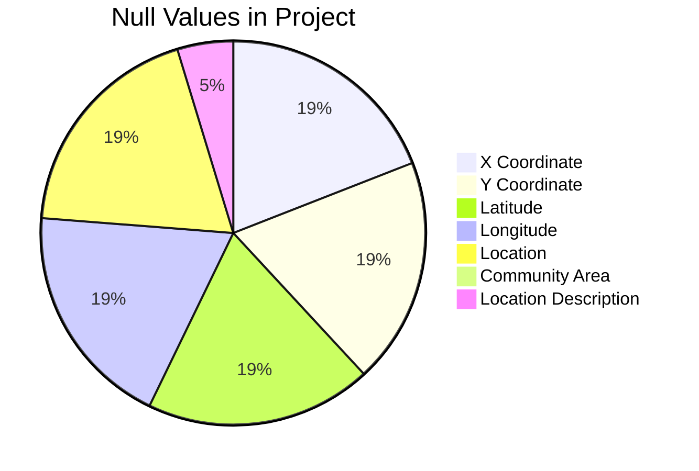

# Data Understanding and Quality Assessment

## Data Overview

Data Shape :

- Total Rows (Entries) : 120759
- Total Columns (Features) : 23

This Dataset contains record for Crimes committed from 2021 to 2025, with various crime categories, which are listed below :

| Crime                             | Count |
| --------------------------------- | ----- |
| Theft                             | 23660 |
| Battery                           | 22338 |
| Criminal Damage                   | 11330 |
| Assult                            | 10341 |
| Other Offense                     | 8201  |
| Motor Vehicle Theift              | 8112  |
| Weapons Violation                 | 7394  |
| Deceptive Practice                | 6992  |
| Narcotics                         | 6894  |
| Robbery                           | 3880  |
| Burglary                          | 3455  |
| Criminal Trespass                 | 2870  |
| Offensive Involving Children      | 806   |
| Criminal Sexual Assult            | 710   |
| Interference With Public Officer  | 670   |
| Public Peace Violation            | 637   |
| Sex Offence                       | 592   |
| Homicide                          | 463   |
| Prostitution                      | 270   |
| Concealed Carry License Violation | 260   |
| Liquor Law Violation              | 232   |
| Arson                             | 230   |
| Stalking                          | 215   |
| Intimidation                      | 73    |
| Kidnapping                        | 56    |
| Obscenity                         | 44    |
| Gambling                          | 13    |
| Public Indecency                  | 9     |
| Human Trafficing                  | 4     |
| Other Narcotic Violation          | 4     |
| Non-Criminal                      | 4     |

The top 5 Crimes, namely Theft, Battery, Criminal Damage, Assult and Other Offence sum up to almost 63% (62.827%) of the total crimes recorded in this dataset.

Out of all these reports, only 39617 of them have been arrested. That is a little below one third of total crimes recorded.

## Missing Value Analysis

Null Values are present only in certain columns of the Dataset

These missing values are in the cases of Narcotics, Deceptive Practice, Theft, Battery and Other Offences.

Narcotics, even though is the 9th most category in which crimes have been reported, it is also the one with the most null values in the whole dataset.

In the Data that are actually missing, it is observed that whenever one of the X coordinate, Y Cootdinate, Latitude, Longitude, Location is a null value, rest of the columns are null as well. This keeps the null count same in all the listed columns.

## Data Quality Analysis

Even though the rest of the data is not null, this does not mean that its right.

There are time stamps in the dataset which indicate crimes have been occuring at 00:00:00 about 4000 times.

There is a very very very low posibility of it being a coincidence, thus indicating wrongly filled data or dates with no time stamps, this puttiing 00:00:00 by default

We will be dropping the rows with timestamp as 00:00:00 along with rows which has null values

The final Rows (entries) in the Dataset are : 114690

Now we will reduce down the features of the dataset by dropping columns which are repeated or which are not requried, even while training a model

The columns which are dropped are :

- IUCR
- Description
- FBI Code
- Updated Om
- Latitude
- Longitude
- X Coordinate
- Y Coordinate
- Location
- Case Number
- \_year (exact copy of column "Year")

The rest of the columns and rows will be used for futher analysis and model training.

## Data Distribution Analysis

District 11 has had the most amount of crime, followed by district 8,6,1 and 12.

The most occuring crimes district wise are :

- District 11 : Narcotics (reaching 2000 cases)
- District 8 : Battery
- District 6 : Battery
- District 1 : Theft
- District 12 : Theft

The graph shows the most amount of crimes have occured at around afternoon, indicating the crimes have been committed in broad daylight while the sun ia at its peak.

# Analysis

## Univariate Analysis

- Crime types: The dataset is dominated by a small set of offenses. Theft, Battery, Criminal Damage, Assault, and Motor Vehicle Theft consistently account for the majority of reported incidents between 2021 and 2025. Together, the top 5–6 crime types represent well over two‑thirds of all recorded crimes.

- Arrest outcomes: Only a minority of incidents result in an arrest. Across 2021–2025, the overall arrest rate is roughly in the mid‑teens (around 14–18%), meaning most reported crimes do not lead to an arrest.

- Patterns:
  - Yearly: Crime counts show clear variation across 2021–2025, with higher levels in the earlier part of the period (around 2021–2022) and a downward trend in later years, especially for violent crime.
  - Monthly: Incidents are more frequent in the warmer months (May–September) and lower in winter, reflecting a strong seasonal pattern.
  - Day of week: Crimes are somewhat more common on weekends, particularly Friday through Sunday.
  - Hour of day: Incidents are lowest in the early morning (around 3–6 AM) and peak in the late afternoon to late night (roughly 3 PM–11 PM).

- Location patterns: A few location categories dominate: Street, Residence, Sidewalk, Vehicle, and Apartment. Public spaces (streets, sidewalks, alleys) together account for a large share of all crimes, while residential locations are also significant.

## BiVariate / MultiVariate Analysis

- Arrest rates differ sharply by crime type:
  - More visible or clearly defined offenses (e.g., some violent crimes, certain weapons and narcotics offenses) tend to have higher arrest rates, often in the 20–30%+ range for specific categories.
  - High‑volume property crimes like Theft, Criminal Damage, and Motor Vehicle Theft generally have lower arrest rates, frequently in the 10–15% range or below.

- Trends over time:
  - Between 2021 and 2025, as total crime counts (especially violent crime) have declined, arrest rates for violent crime have risen, reaching their highest levels since the pandemic in recent years.
  - This indicates improved clearance for serious offenses even as the total number of incidents falls.

- Location strongly shapes both volume and type of crime:
  - Street and sidewalk locations see the highest raw counts and are heavily represented in batteries, assaults, robberies, and narcotics offenses, especially during evening and night hours.
  - Residences and apartments show a large share of domestic‑related batteries, assaults, and some burglaries, with incidents more evenly spread across the day but still elevated in evenings and weekends.
  - Vehicles (including parked cars) are strongly associated with theft from vehicles and motor vehicle theft.

- Arrest rates by location:
  - Crimes occurring in public, high‑visibility locations (streets, sidewalks, commercial areas) tend to have higher arrest rates than those in more private or isolated settings.
  - Incidents inside residences or apartments often have lower arrest rates, particularly when they involve domestic disputes without clear physical evidence or independent witnesses.

## Trends and Pattern Analysis

- The hourly distribution shows a consistent pattern from 2021 to 2025:
  - Lowest activity in the early morning (around 3–6 AM).
  - A steady rise through the morning, with a plateau or slight dip around midday.
  - A sharp increase from late afternoon into the night, with a peak between roughly 6 PM and 11 PM.
- This pattern is especially pronounced for violent crimes (battery, assault, robbery) and narcotics offenses, which are heavily concentrated in evening and night hours on streets and sidewalks.

- Yearly trends:
  - The period starts with relatively high crime levels in 2021–2022, following the pandemic‑era surge in violent crime.
  - From 2023 onward, there is a clear downward trend in total incidents, particularly for violent crime, continuing into 2024–2025.
  - Homicides and other serious violent offenses have fallen substantially from their 2020–2021 peaks, reaching multi‑year lows by 2025.

