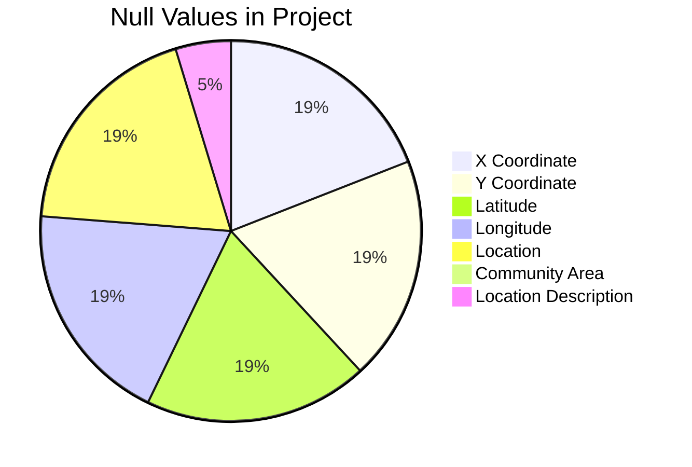

# Data Understanding and Quality Assessment

## Data Overview

Data Shape :

- Total Rows (Entries) : 120759
- Total Columns (Features) : 23

This Dataset contains record for Crimes committed from 2021 to 2025, with various crime categories, which are listed below :

| Crime | Count |
| --- | --- |
| Theift | 23660 |
| Battery |22338 |
| Criminal Damage | 11330 |
| Assult | 10341 |
| Other Offense | 8201 |
| Motor Vehicle Theift | 8112 |
| Weapons Violation | 7394 |
| Deceptive Practice| 6992 |
| Narcotics | 6894 |
| Robbery | 3880 |
| Burglary | 3455 |
| Criminal Trespass | 2870 |
| Offensive Involving Children | 806 |
| Criminal Sexual Assult | 710 |
| Interference With Public Officer | 670 |
| Public Peace Violation| 637 |
| Sex Offence | 592 |
| Homicide | 463 |
| Prostitution | 270 |
| Concealed Carry License Violation | 260 |
| Liquor Law Violation | 232 |
| Arson | 230 |
| Stalking | 215 |
| Intimidation | 73 |
| Kidnapping | 56 |
| Obscenity | 44 |
| Gambling | 13 |
| Public Indecency | 9 |
| Human Trafficing | 4 |
| Other Narcotic Violation | 4 |
| Non-Criminal | 4 |

The top 5 Crimes, namely Theft, Battery, Criminal Damage, Assult and Other Offence sum up to almost 63% (62.827%) of the total crimes recorded in this dataset.

Out of all these reports, only 39617 of them have been arrested. That is a little below one third of total crimes recorded.

## Missing Value Analysis

Null Values are present only in certain columns of the Dataset

## Data Quality Analysis

- reduce data set and only show whats important

## Data Distribution Analysis

- distrcit wise crime if possible
- analyse the crime type, where it has happened, how many times, and if the suspect was caught or not

# Analysis

## Univariate Analysis

- top crime per year
- no of not arrested per year and year with highest not arrested suspects

## BiVariate / MultiVariate Analysis

- Crime vs caught
- Crime vs Location
-

## Trends and Pattern Analysis

- line graph for crime time in a day
- line and bar graph for crimes vs times vs no of caught

# Key Insights

-
